# MBDS Blockchain — Crowdfunding DApp

- *ANDRIANIONY Miharizo Kanto*
- *RAJERISON Lalaina Nancia*
- *RAKOTONDRAMAKA Asandratra Mitia Ny Aina*
- *RANDRIAMIFIDY Dina Valisoa*

Crowdfunding platform on Ethereum Sepolia testnet.  
Smart contract (Solidity) + React frontend.

---

## Description

Ce projet est une plateforme de crowdfunding décentralisée permettant aux utilisateurs de financer et de soutenir des projets via la blockchain.

Grâce à l’utilisation de smart contracts sur Ethereum, les transactions sont transparentes, sécurisées et ne nécessitent aucun intermédiaire. Les utilisateurs peuvent créer des campagnes, contribuer à des projets et suivre les financements en temps réel.

L’application s’appuie sur une interface web développée en React, connectée à la blockchain via Ethers.js et MetaMask. Les contenus (images) sont stockés de manière décentralisée grâce à IPFS via Pinata.

---

## Stack

| Layer | Tech |
|---|---|
| Smart contract | Solidity 0.8.20 + OpenZeppelin |
| Blockchain | Ethereum Sepolia testnet |
| Frontend | React + Vite + ethers.js |
| Image storage | IPFS via Pinata |
| Deploy tooling | Hardhat |

---

## Prerequisites

- Node.js ≥ 18
- pnpm (`npm install -g pnpm`)
- MetaMask with a **dedicated testnet wallet** (never use main wallet)
- Sepolia ETH → [sepoliafaucet.com](https://sepoliafaucet.com)
- Free Pinata account → [app.pinata.cloud](https://app.pinata.cloud)

---

## Setup

```bash
pnpm install
```

Create `front/.env`:

```
VITE_PINATA_JWT=eyJ...your_pinata_jwt
PRIVATE_KEY=0x...your_wallet_private_key
```

> ⚠️ `front/.env` is in `.gitignore` — never commit it.

---

## Deploy contract to Sepolia

### 1. Compile

```bash
npm run compile
```

### 2. Deploy

```bash
npm run deploy:sepolia
```

Output:
```
━━━━━━━━━━━━━━━━━━━━━━━━━━━━━━━━━━━━━━━━
Deployer : 0xYourAddress
Balance  : 0.15 ETH
━━━━━━━━━━━━━━━━━━━━━━━━━━━━━━━━━━━━━━━━
Deploying Crowdfunding...
✓ Deployed to: 0xNEW_CONTRACT_ADDRESS
✓ contract.js updated → 0xNEW_CONTRACT_ADDRESS
━━━━━━━━━━━━━━━━━━━━━━━━━━━━━━━━━━━━━━━━
```

The script **automatically updates** `front/src/services/contract.js` with the new address.  
No manual copy-paste needed.

### 3. Verify address was updated

Check `front/src/services/contract.js` line 3:

```js
export const CONTRACT_ADDRESS = '0xNEW_CONTRACT_ADDRESS';
```

---

## Update contract address manually

If auto-update fails, open `front/src/services/contract.js` and replace:

```js
export const CONTRACT_ADDRESS = '0xOLD_ADDRESS';
// →
export const CONTRACT_ADDRESS = '0xNEW_ADDRESS';
```

---

## Run frontend

```bash
npm run dev
```

Opens at `http://localhost:5173`

---

## Scripts

| Command | Description |
|---|---|
| `npm run dev` | Start frontend dev server |
| `npm run compile` | Compile Solidity contracts |
| `npm run deploy:sepolia` | Deploy to Sepolia + auto-update address |
| `npm run build` | Build frontend for production |
| `npm run test` | Run Hardhat tests |

---

## Project structure

```
mbds-blockchain/
├── contracts/
│   └── Crowdfunding.sol        # Main smart contract
├── scripts/
│   └── deploy.cjs              # Deploy script (auto-updates contract.js)
├── front/
│   ├── src/
│   │   ├── pages/              # React pages
│   │   ├── components/         # UI components
│   │   ├── services/
│   │   │   ├── contract.js     # ABI + contract address ← updated on deploy
│   │   │   ├── campaigns.js    # On-chain read helpers
│   │   │   ├── transactions.js # Write tx helpers
│   │   │   ├── wallet.js       # MetaMask connection
│   │   │   └── pinata.js       # IPFS upload
│   │   └── hooks/
│   ├── .env                    # VITE_PINATA_JWT + PRIVATE_KEY (gitignored)
│   └── index.html
├── hardhat.config.cjs
└── package.json
```

---

## Get private key (MetaMask)

1. MetaMask → click account avatar
2. **⋮** → **Account details**
3. **Show private key** → enter password
4. Copy the `0x...` string (66 chars total)

---

## Troubleshooting

| Error | Fix |
|---|---|
| `VITE_PINATA_JWT manquant` | Add JWT to `front/.env`, restart `npm run dev` |
| `private key too short` | Key must be `0x` + 64 hex chars (66 total) |
| `Deployer has 0 ETH` | Get Sepolia ETH from faucet |
| `Cannot find module 'dotenv'` | Run `pnpm add -D dotenv` |
| Contract calls fail after redeploy | Check `CONTRACT_ADDRESS` in `contract.js` is updated |

---

## Demonstration
Une vidéo de démonstration est disponible pour illustrer le fonctionnement de la plateforme.

Lien: [Vidéo de démonstration](https://youtu.be/hFjApUvPLj4?si=oOF3I9zPr6a5LgnL)

Elle couvre l’architecture, les fonctionnalités principales ainsi que l’utilisation de l’application.

---

## Captures d'écran

### Page d'accueil sans portefeuille connecté
### Liste des campagnes 
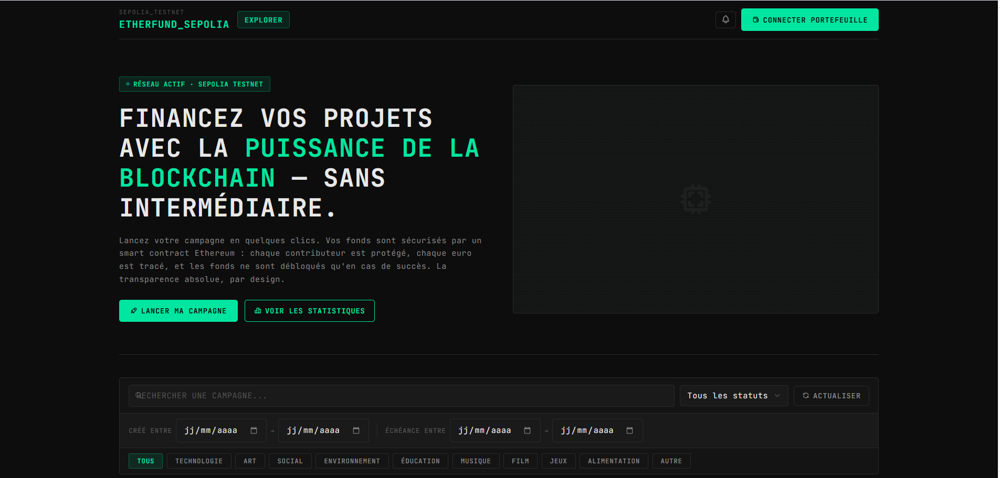
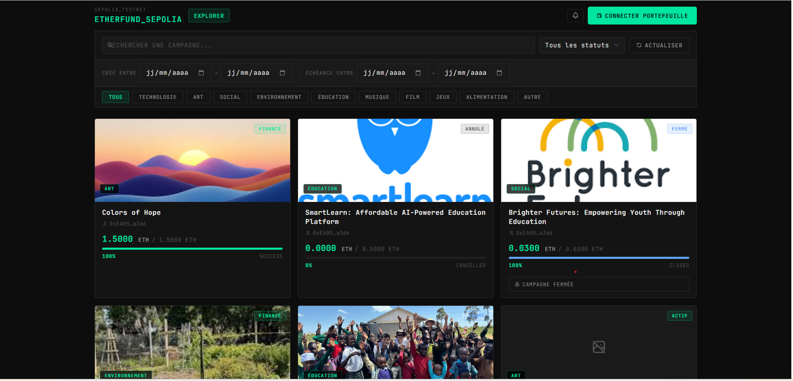
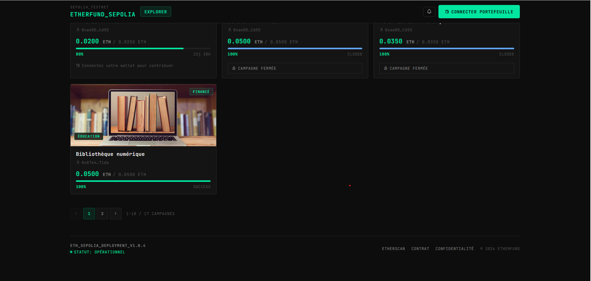

### Page d'accueil avec portefeuille connecté
#### 1-Liste des campagnes avec formulaire de contributions
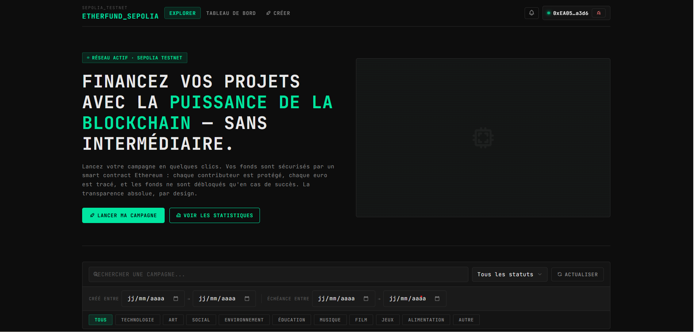
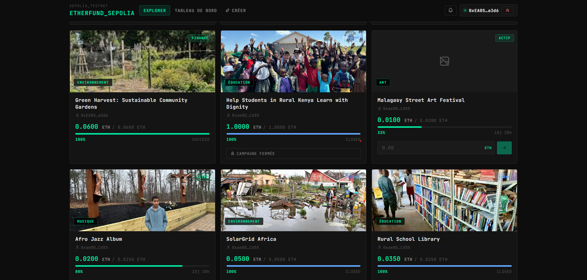

#### 2-Liste des transactions
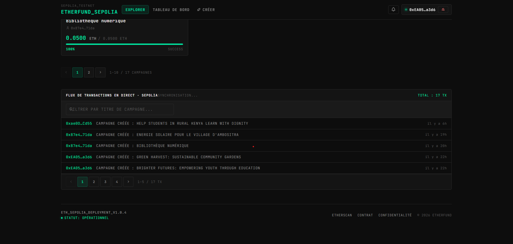

### Page de création de campagne
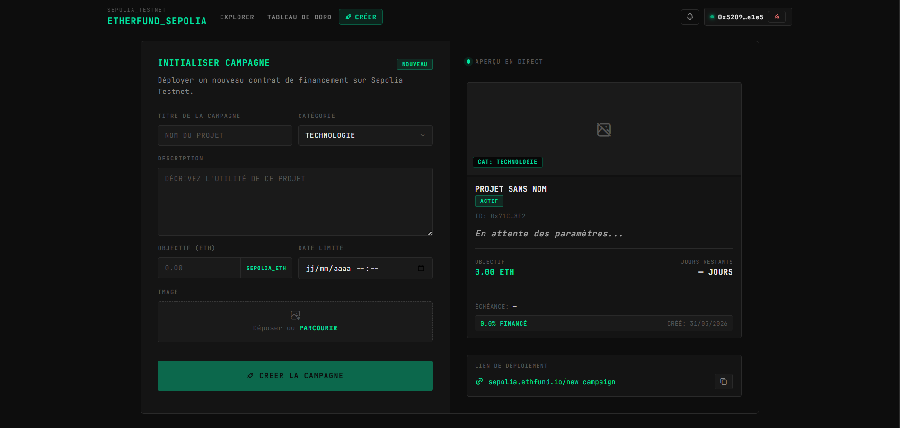

### Page de détails de campagne
#### 1-Campagne active
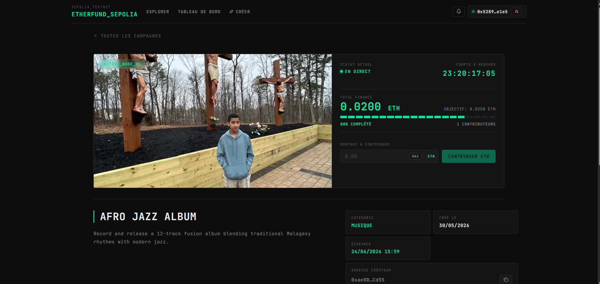
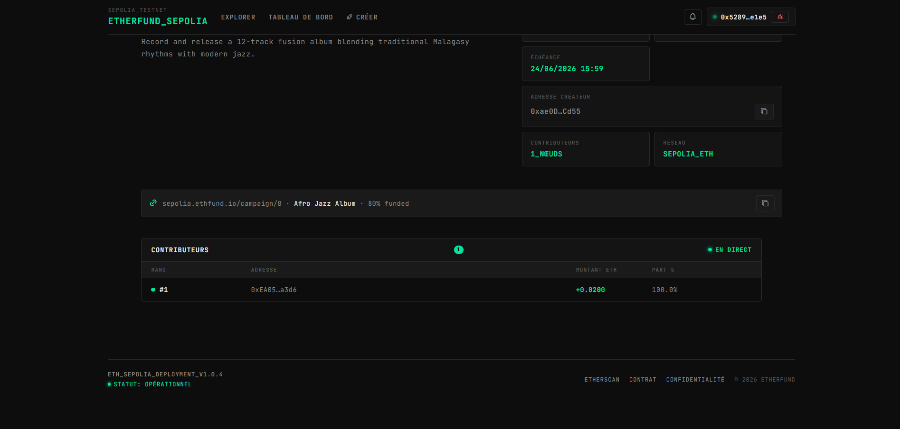

#### 2-Campagne annulée
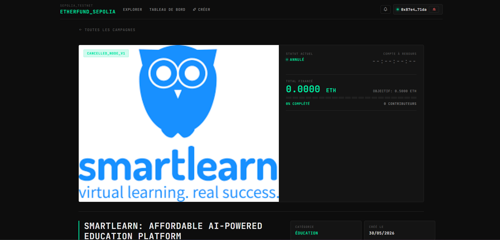

#### 3-Campagne succès (vu contributeur/visiteur)
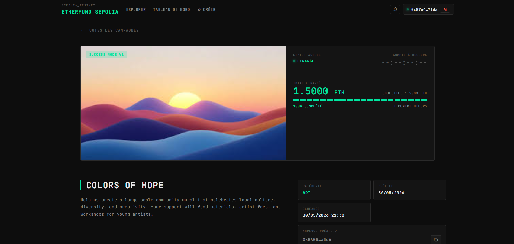

#### 4-Campagne succès (vu propriétaire)
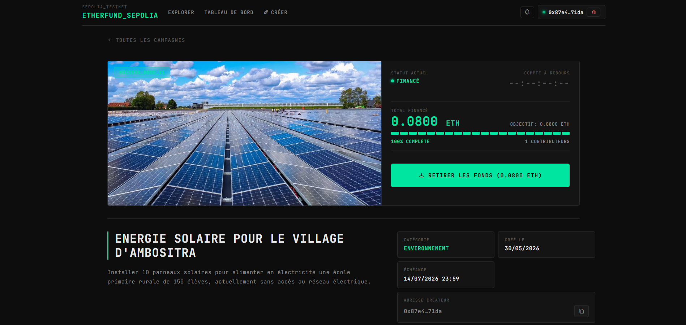

#### 5-Campagne succès (montant retiré)
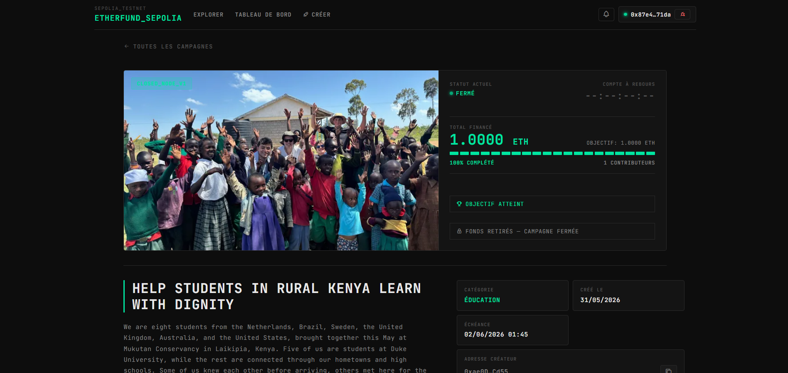

### Formulaire de modification d'une campagne
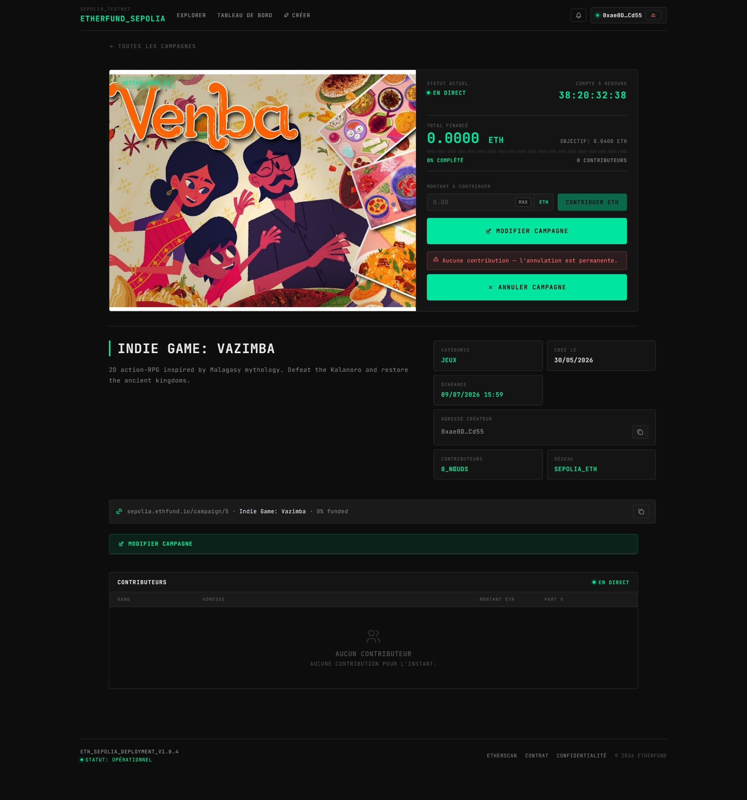
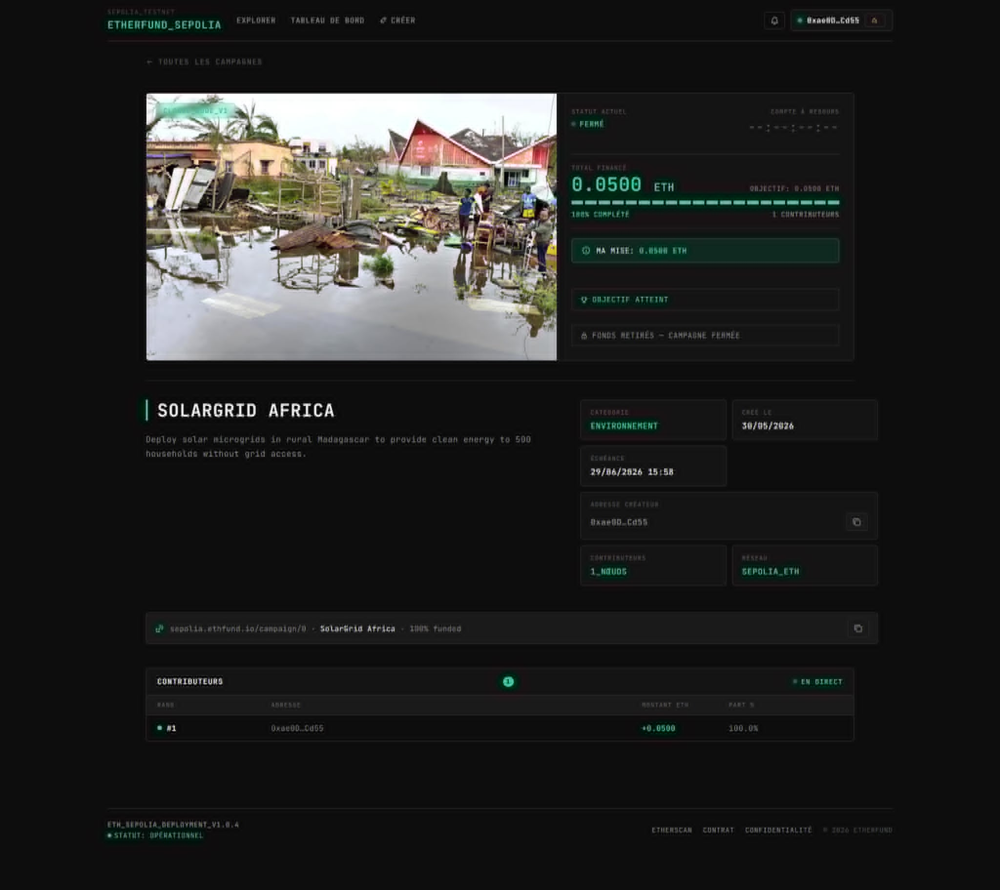

### Page des tableaux de bord
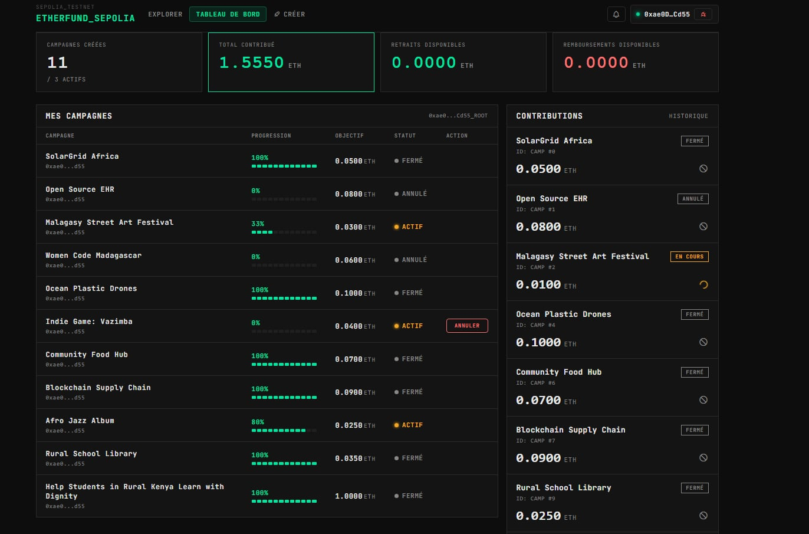
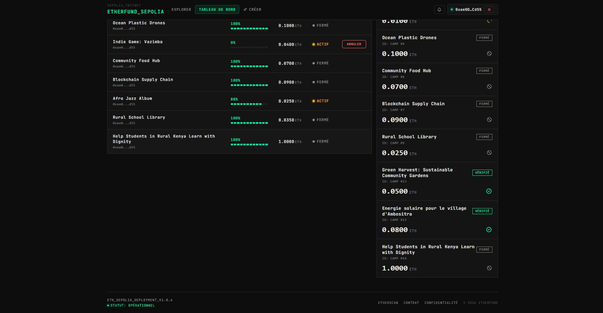

### Etherscan
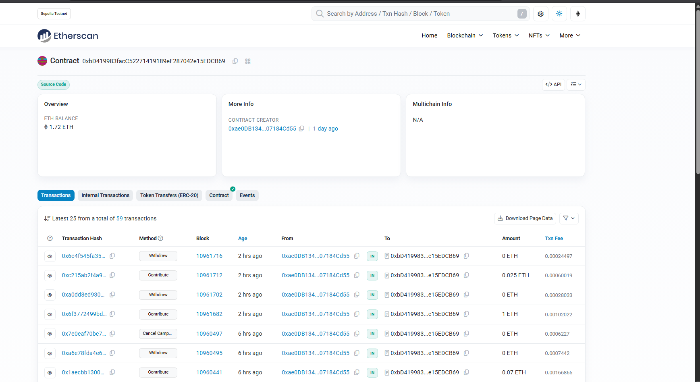

### Metamask
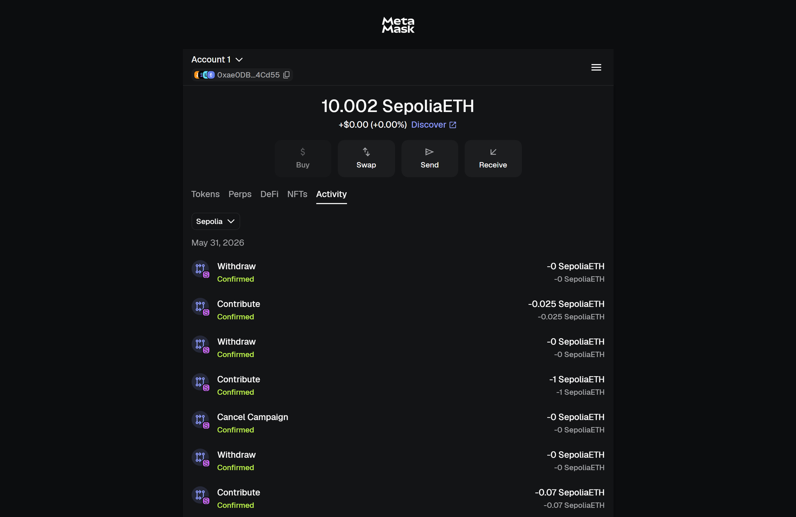